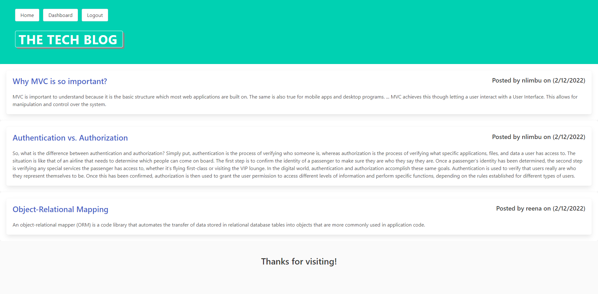

# tech-blog

Built a CMS-style blog site similar to a Wordpress site, where you can publish a blog posts and comment on other developers’ posts as well.



## [Deployed Application](https://nlimbu07.github.io/tech-blog/)

## User Story

```
AS A developer who writes about tech
I WANT a CMS-style blog site
SO THAT I can publish articles, blog posts, and my thoughts and opinions
```

## Installation

This project requires all these packages to be installed.

- mysql2
- npm 'express'
- npm 'express-handlebars'
- npm 'express-session'
- npm 'handlebars'
- npm 'sequelize'
- npm 'bcrypt'

## Questions

If you have any questions or inquiries, please reach out through GitHub or email.

- GitHub: nlimbu07
- email: nlimbu@yahoo.com
